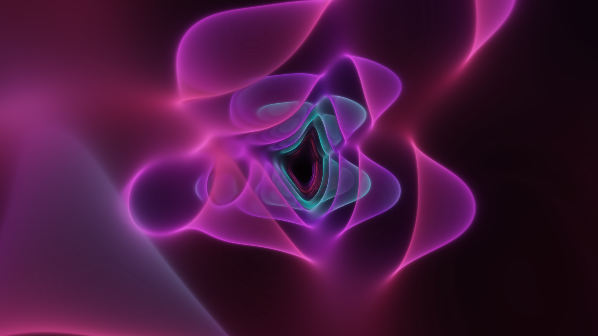
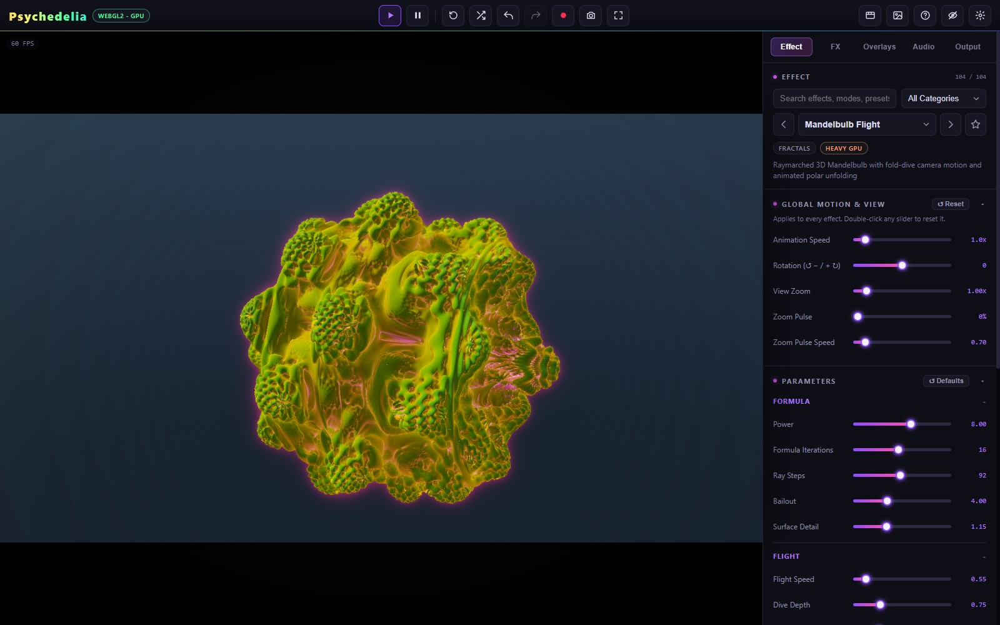
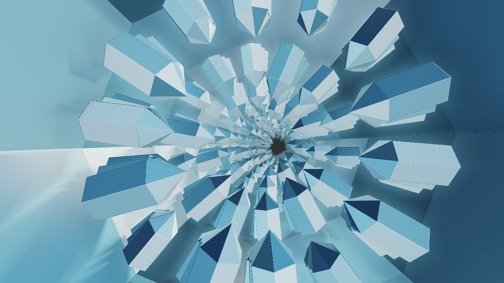
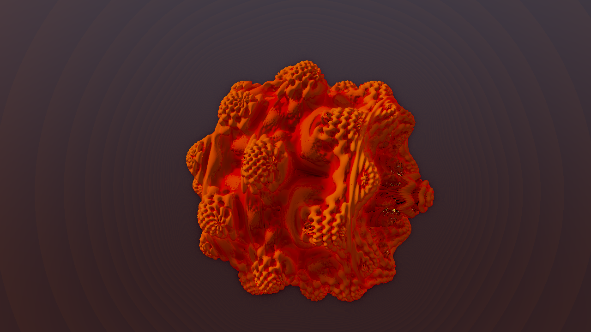

# Psychedelia Studio

**Create music-reactive animations, endless fractal worlds, and hypnotic videos.**



Turn a song into moving visuals. Fly through mathematical worlds, build psychedelic loops, and render smooth 60 FPS MP4 videos—all in your browser. Psychedelia Studio brings procedural animation, fractal art, beat reactions, and video export into one visual workspace.

Create music visualizer videos, VJ loops, animated backgrounds, and generative art. Start with a preset, choose your colors, add music, and shape the result with live controls. No account or installation is required for the built-in studio.

**104 effects · 39 Post FX · 22 overlays · 71 shared palettes · live recording and frame-by-frame MP4 rendering**

[**Launch Psychedelia Studio →**](https://aivrar.github.io/psychedelia-studio/)

[Start here](docs/wiki/Quick-Start.md) · [Full wiki](https://github.com/aivrar/psychedelia-studio/wiki) · [Effect catalog](docs/wiki/Effect-Catalog.md) · [Render a 60 FPS MP4](docs/wiki/Rendering-and-Recording.md) · [Screenshot gallery](docs/wiki/Gallery.md)

## Make something

[Open the studio in your browser](https://aivrar.github.io/psychedelia-studio/) to start creating. To run your own local copy:

1. Download or clone the project and open a terminal in its folder.
2. Serve it locally, for example with Python:

   ```sh
   python -m http.server 8000 --bind 127.0.0.1
   ```

3. Open **http://localhost:8000** in Chrome or Edge with hardware acceleration enabled.
4. Choose an **Effect**, pick a palette or starter preset, then open **Audio** to start Studio Music or load a track.
5. Open **Output**, choose a resolution and **60 FPS**, set the length under **Render MP4**, and render.

Opening `index.html` directly also works for the core app and has been tested. A stable localhost address is preferable for browser storage and media features. No account, server application, API key, or package installation is required for the built-in effects.

## Inside the studio



- **Explore:** fractal flights, mathematical patterns, fluid simulations, cosmic scenes, and eight scenes in the Endless Scenes category, including an industrial world of dancing robots.
- **Shape the look:** native palettes plus a shared palette library, effect-specific parameters, starter presets, post-processing, image/text overlays, and global motion controls.
- **React to music:** generated Studio Music, uploaded audio, or browser playback capture; beat and frequency sources; global reactions; per-effect parameter links; fine tuning for attack, release, and motion.
- **Keep the scene recognizable:** Preserve scene shuffle varies lighting, color, and restrained accents. Wild shuffle keeps the larger distortions available. Schedule changes every 4, 8, or 16 bars.
- **Save your work:** local autosave, named setups with audio/image assets, undo/redo, timeline JSON files, and a separate Shadertoy project library.
- **Export:** live MP4/WebM recording, PNG snapshots, or a fixed-duration MP4 rendered one frame at a time with Studio or file audio.

| Endless structures | Fractal flight |
| --- | --- |
|  |  |
| [Endless scenes](docs/wiki/Endless-Scenes.md) | [Fractals and mathematical labs](docs/wiki/Fractals-and-Math.md) |

## About 60 FPS

Live recording follows the machine's real rendering speed. A heavy scene cannot produce 60 distinct live frames each second if the GPU only renders 30. **Render MP4** and **Smooth MP4** advance a fixed frame clock and wait for every frame, so a slow render takes longer instead of skipping animation time. Select **60 FPS** explicitly; the output default is 30.

Render speed depends on the scene, resolution, GPU, and encoder. This is not a blanket real-time 4K/60 guarantee. Capture Playback requires live recording; direct rendering supports Studio Music and audio files. [Export modes, soundtrack behavior, and limits](docs/wiki/Rendering-and-Recording.md).

## Documentation and development

The [wiki source](docs/wiki/Home.md) is readable directly in this repository. It includes illustrated workflows, full effect/FX/overlay parameter references, performance troubleshooting, architecture, and publishing instructions for `aivrar/psychedelia-studio`.

Built with JavaScript, WebGL, Canvas, Web Audio, and WebCodecs. The runtime is `index.html`, `style.css`, `src/`, and `lib/`; it has no build step. Node is only needed for development tools. Start with [Development](docs/wiki/Development.md) and [Contributing](CONTRIBUTING.md).

```sh
node --test tools/beat-reactor.test.mjs tools/core-regression.test.mjs tools/shuffle.test.mjs
node tools/smoke-test.mjs --contract-only
node tools/check-wiki.mjs
```

Browser tooling uses an installed Chrome or Edge; set `BROWSER` to its executable if needed. Experiments, backups, historical notes, and generated audit output are excluded from the public repository.

## Credits and license status

Project by **[aivrar](https://github.com/aivrar)**. See [Third-party notices](THIRD_PARTY_NOTICES.md) for bundled dependencies and shader attribution notes. A project-wide license has not yet been selected; this README does not grant a new license. Imported shaders and media retain their own rights and terms.
