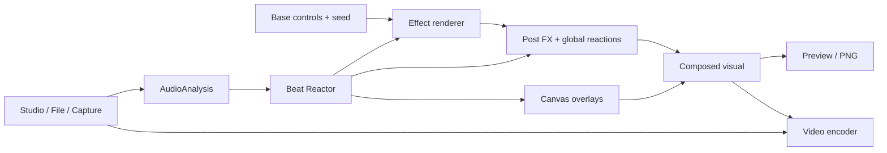

# Architecture

Psychedelia Studio is a static HTML/CSS/JavaScript application using classic script globals. `index.html` establishes script order, then `src/app.js` initializes the workspace. There is no main-app bundler, dependency install, or server API.

## Runtime map

| Area | Main files | Responsibility |
| --- | --- | --- |
| Bootstrap | `index.html`, `style.css`, `src/app.js` | Script loading, layout, initialization, output controls, shortcuts |
| Effect registry | `src/effects/registry.js` | Register definitions, palettes, metadata, switching and shader specialization |
| Renderer | `src/engine/renderer.js`, `shader-manager.js` | Canvas, WebGL/CPU backend, preview clock, quality, global view, frame export |
| Effects | `src/effects/*.js` | GLSL/CPU definitions, custom renderers, parameters and presets |
| Shared math helpers | `fractal-flight-common.js`, `fractal-lab-common.js`, `endless-scenes.js` | Family contracts, common controls and shader helpers |
| Post-processing | `post-process.js`, `post-fx-library.js` | Ordered passes, history buffers, global audio image treatment |
| Overlays | `overlays.js` | Canvas 2D layers, compositing, trigger/modulation settings |
| Music | `music.js`, `music-genres.js`, `music-sounds.js`, `lib/tone.min.js` | Synthesis, sequencer, genre patterns, mixer, offline music graph |
| Analysis/reactivity | `audio-analysis.js`, `audio-signal.js`, `audio-reactor.js` | Source router, spectral/hit analysis, musical clock, global outputs and links |
| Export | `export.js`, `mp4-writer.js`, `offline-audio.js` | Live and fixed-step video encoding, muxing, offline soundtrack and signal playback |
| State | `setups.js`, `edit-history.js`, `timeline.js` | Local persistence, creative history, effect clips |
| Interface | `src/gui/*.js` | Parameter editors, sidebar, shuffle, source controls, render controls, timeline, Gallery |
| Shadertoy host | `shadertoy-*.js`, `shadertoy-host.js`, `shadertoy-editor.js` | Compiler wrapping, uniforms, pass graph, channels and project editor |
| Progressive density | `progressive-density-renderer.js`, `src/workers/progressive-density-worker.js` | Background sampling and accumulated image presentation |

Engine filenames in the table are under `src/engine/` unless otherwise specified. GUI files live in `src/gui/`.

## Frame and signal flow

This diagram describes the conceptual dependencies. Offline export replaces live source reads with an offline soundtrack and synchronized signal events rather than recording the current speaker output.

## Base values versus modulation

Controls retain base values. Reactor links compute temporary effective values within parameter bounds. Saving and undoing the base look should not accidentally persist a transient kick-modulated value. Consumers that need stable project state use `Controls.getBaseValues()` where available.

Metadata marks parameters that should not receive generic links. Palette selectors expand through `PsyPalettes`, preserving the original options before shared entries. Family metadata supplies contracts and starter presets; tests and generated documentation read the same definitions.

## Clocks and rendering modes

Preview normally follows animation frames and quality heuristics. Offline MP4 export advances a fixed frame time and waits for encoder backpressure. Audio timestamps derive from sample counts; output video timestamps derive from the output frame grid. Shuffle consumes musical/render-clock progression so it remains meaningful when wall-clock rendering is slow.

Studio offline music uses a separate audio graph and returns events synchronized to its generated soundtrack. The live graph and playback preferences are preserved across the render job.

## Persistence and history

Named/current setups and binary assets use IndexedDB. UI preferences and custom shader project storage use local storage. Edit history stores bounded creative snapshots, grouping compound user actions and avoiding frame-driven changes. Timeline has its own JSON serialization and clip semantics.

## Extension principles

Keep stable effect IDs, valid defaults, explicit parameter groups, and bounded ranges. Preserve seeded spatial identity for endless worlds. Add one effect registration/script entry in the intended load position. Use optional family metadata accurately; the contract tests treat it as executable expectations.

For lifecycle-sensitive effects, provide initialization/cleanup and release GPU/media resources. History buffers, worker convergence, and external video cannot be treated as pure `f(time)` scenes. Document their export limitations. See [Development](Development.md).
