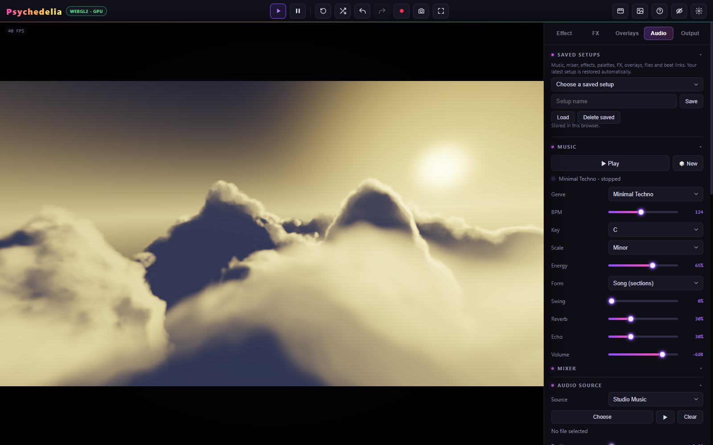
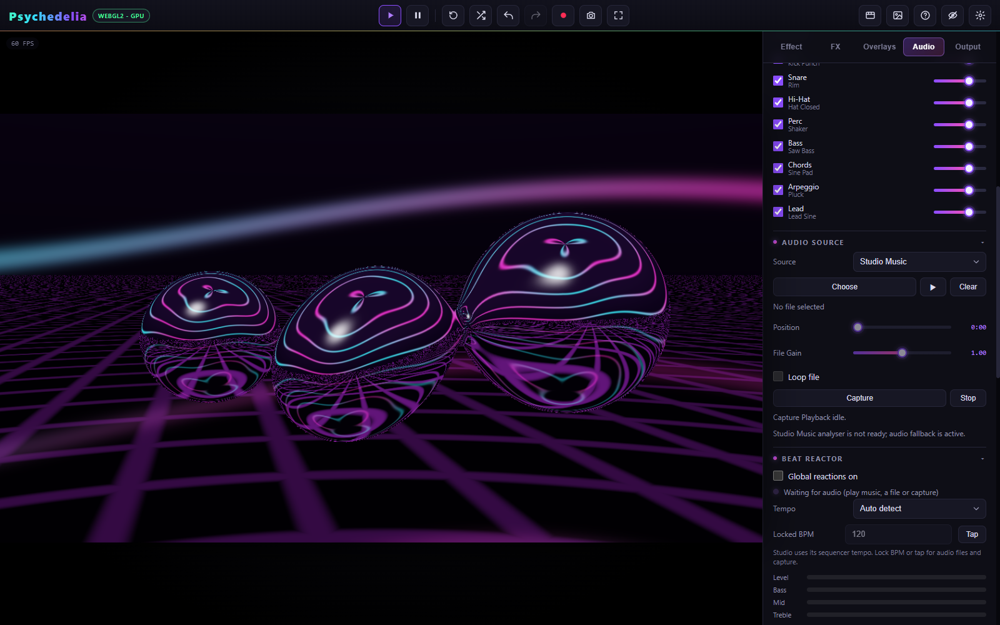
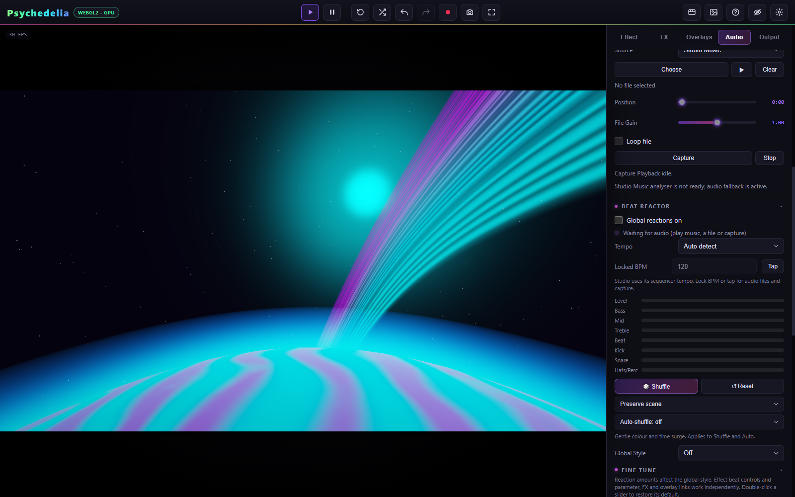

# Audio and Studio Music

The **Audio** tab brings together local setups, generated music, source selection, the Beat Reactor, and effect parameter links. Selecting an analysis source and starting its playback are separate actions.

## Audio sources

| Source | How to start | What it supplies | Offline render |
| --- | --- | --- | --- |
| **Studio Music** | Music → Play | Generated soundtrack, exact sequencer beats and section events | Yes, as a new take using current settings |
| **Audio File** | Choose a file, then use its play button | File playback, frequency analysis, detected hits and tempo | Yes, from the chosen file position or full-track mode |
| **Capture Playback** | Capture, then select a browser-provided tab/window/screen source with audio | Captured audio and detected beats | Live recording only |

The source router also supplies fallback analysis for shader channels when live analysis is unavailable. This is synthetic visual data, not a fourth playable song source in the main source selector.

Studio audio and file playback have independent controls. Choosing a different analysis source does not mean that every other audible source is necessarily stopped. For a clean **live** recording, stop sources you do not want in the app's mixed audio. A **direct render** uses its selected offline soundtrack instead of recording the live mix.

## Studio Music

Press **Play** to start. **New** creates another musical take and can change key, tempo, scale, and patterns. The selected genre provides a musical starting point; it is not a prerecorded audio file.

| Control | Use |
| --- | --- |
| Genre | Choose an instrument/pattern style. The [Music Reference](Music-Reference.md) lists the current genres. |
| BPM | Set the Studio sequencer tempo, 40–220. Studio beat timing follows this clock directly. |
| Key / Scale | Change the pitch center and note vocabulary. |
| Energy | Adjust musical intensity and activity. |
| Form | **Song (sections)** includes arrangement changes; **Loop (no intro/break)** keeps a more immediate loop-oriented arrangement. |
| Swing | Offset the rhythmic feel. |
| Reverb / Echo | Set the music's spatial/time effects. |
| Volume | Master output level. |

Open **Mixer** for the eight instrument channels: Kick, Snare, Hi-Hat, Perc, Bass, Chords, Arpeggio, and Lead. Each has an on/off control and level. The sound label shows the instrument voice selected by the current musical configuration.

Mixer choices matter to the Beat Reactor. A muted drum should not keep issuing the same Studio hit strength as an audible drum. If an expected reaction is absent, inspect both the instrument switch and its level before increasing sensitivity.

## Uploaded audio

1. Choose **Audio File** under Audio Source.
2. Press **Choose** and select a supported local audio file.
3. Wait for loading, then press the file's play button.
4. Seek with the playhead slider; set **Loop file** and **Gain** as needed.
5. Check the Level/Bass/Mids/Treble meters under Beat Reactor.

Gain runs from 0 to 2. Zero gain is intentionally silent and does not represent a broken input. Replace the file with Choose or remove it with Clear. File decoding depends on the browser's supported audio formats; a common WAV or MP3 is a useful diagnostic alternative.

**Match full audio track** renders from the beginning of the uploaded file. **Remaining audio** starts at the current file playhead. **Custom duration** with Audio File selected also starts at that playhead and honors the loop setting. Full and remaining modes ignore file looping. See [Rendering and Recording](Rendering-and-Recording.md).

## Capture Playback

Press **Capture** and use the browser's selection dialog. Whether audio is available depends on the browser, OS, and chosen surface. A video stream without an audio track is rejected with a source-status message. Selecting a screen does not guarantee that all system sound will be captured.

Press **Stop** to end capture. Switching away from Capture also stops its tracks. Permission and the browser picker are required again for a later capture; a saved setup cannot silently resume it.

Capture Playback uses display capture. The separate Shadertoy channel system can explicitly request webcam or microphone inputs; those are different controls and permissions.

## Tempo and beat diagnosis

Studio uses the sequencer's BPM. For files and captured playback, choose **Auto detect** or **Lock BPM** in Beat Reactor. Tap several beats with **Tap** to set a locked tempo when automatic detection follows a half-time or double-time pulse.

If meters move but the scene does not, inspect global amounts, built-in effect response, and links. If meters do not move, check source, transport, gain, mixer, and capture status first. [Beat Reactor](Beat-Reactor.md) explains the response controls.
