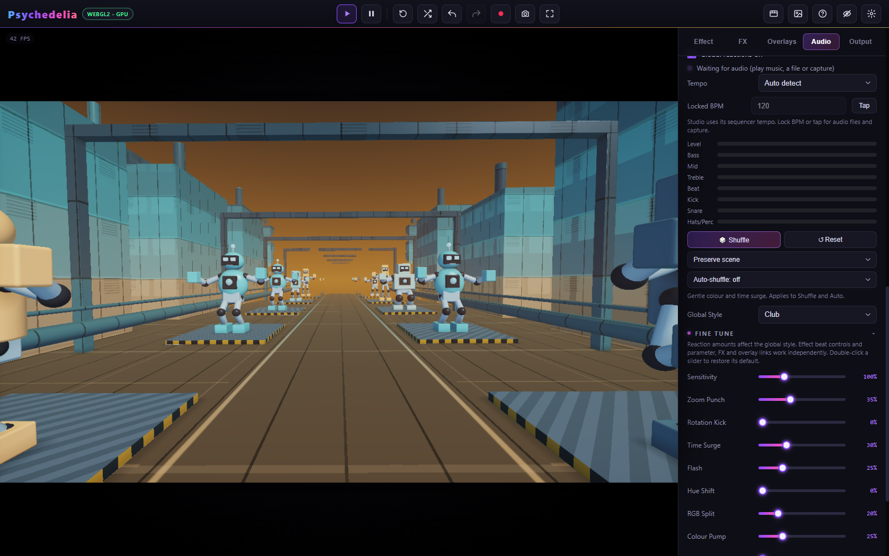
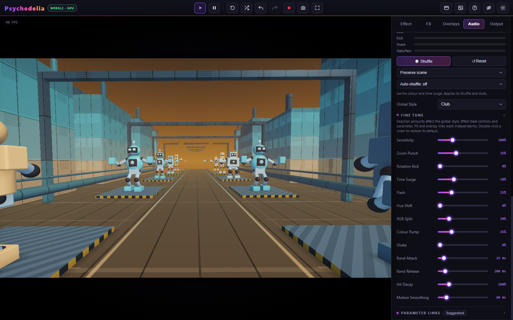
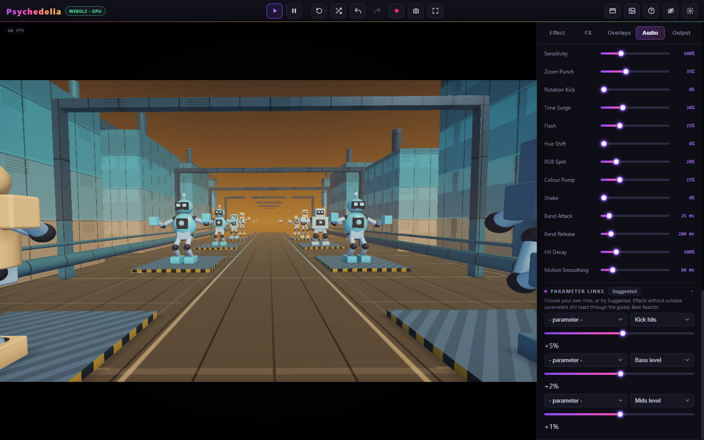

# Beat Reactor

Beat Reactor converts sound into continuous bands, hit pulses, tempo, and musical modulation. It can add global movement or drive individual effect, FX, and overlay controls.

## Understand the independent routes

| Route | Where to edit it | Example |
| --- | --- | --- |
| Global reactions | Audio → Beat Reactor → Global Style / Fine Tune | Zoom Punch or Time Surge across every effect |
| Effect's own response | Effect → Parameters | Robot Foundry Music Response or another scene's Audio React |
| Effect parameter links | Audio → Parameter Links | Bass drives a glow parameter |
| Post FX modulation | FX → music-note control beside a setting | A color effect follows a bar wave |
| Overlay modulation / triggers | Overlays → music-note control, Fire On, Sync | Rings triggered on a kick |

Turning off global reactions, or choosing **Off** for Global Style, does not remove the other routes. This lets you retain a scene's built-in choreography while disabling full-screen zoom or camera shake.

## Global Style

**Club** is the default. **Subtle** is a gentler starting point; **Psychedelic** introduces stronger color/rotation; **Wild** adds larger movement. **Custom** indicates edited amounts. The enable switch lets you suspend global reactions while retaining their configured style.

| Reaction | What it changes | Club default |
| --- | --- | --- |
| Zoom Punch | Image scale on kick hits | 35% |
| Rotation Kick | Alternating image twist on kicks | 0% |
| Time Surge | Smooth animation acceleration from bass/beats | 30% |
| Flash | Image brightness on hits/drops | 25% |
| Hue Shift | Color rotation with beats and sections | 0% |
| RGB Split | Channel separation on percussion | 20% |
| Colour Pump | Saturation/glow emphasis with bass | 25% |
| Shake | Camera/image shake on hits | 0% |

Each amount is 0–100%. Zero disables that global reaction. Style presets set these eight amounts; timing and sensitivity remain separate controls.

## Fine Tune

| Control | Range | Default | When to change it |
| --- | --- | --- | --- |
| Sensitivity | 25–300% | 100% | Raise for quiet material or softer hits; lower when small transients cause too much activity. |
| Band Attack | 5–250 ms | 25 ms | Higher smooths the rise of bass/mid/high/loudness. Drum hit envelopes remain immediate. |
| Band Release | 40–1,500 ms | 200 ms | Higher lets continuous bands fade more slowly between sounds. |
| Hit Decay | 25–400% | 100% | Lower gives crisp short hits; higher leaves a longer pulse. |
| Motion Smoothing | 10–500 ms | 80 ms | Higher eases Time Surge and Hue Shift. It is not a blanket smoothing control for every link. |

Double-click a slider to restore its default. Start by changing one amount and one timing control. High sensitivity, long decay, and strong modulation together can keep a setting near its limit; increasing all of them is rarely the clearest way to make a beat visible.

Useful starting adjustments:

- **Gentle scene lighting:** Subtle; Zoom Punch, Rotation Kick, and Shake at 0; a small bass-to-glow link.
- **Crisp percussion:** keep Band Attack near default, reduce Hit Decay, and use a kick/snare source rather than overall loudness.
- **Slow atmospheric breathing:** use Wave / bar or Slow wave / 4 bars with a low signed amount.
- **Less camera motion:** lower Zoom Punch first; remove Rotation Kick/Shake; use Time Surge for speed variation instead of directly modulating a scene's travel speed.

These are starting recipes, not additional built-in presets.

## Sources and timing

| Source | Character |
| --- | --- |
| Kick / Snare / Hats & percussion | Short detected or sequencer-driven hits |
| Beat pulse | A tempo-related pulse |
| Drops & sections | Studio arrangement events; not a universal drop detector for arbitrary files |
| Bass / Mids / Highs | Continuous smoothed spectral bands |
| Loudness | Overall signal level |
| Beat ramp | Rising phase across a beat |
| Wave / beat | One smooth cycle per beat |
| Wave / bar | One cycle per four beats |
| Slow wave / 4 bars | One cycle per sixteen beats |

Studio beat timing is exact from the sequencer. External tempo can be estimated, locked between **40–240 BPM**, or set with Tap. The tempo waves continue at Studio BPM when no audio is playing. A moving LFO during silence is expected.

## Per-effect parameter links

There are three link rows. Choose a destination parameter, a source, and a signed amount. Positive amounts push in one direction and negative amounts in the other. Zero leaves the destination unchanged. Modulation is bounded by the parameter's valid range; extreme base values can leave little room to move.

On a first visit, eligible effects receive gentle suggested links. Their destination choices depend on the active effect, so the rows change when you change scenes. Your custom links and intentionally cleared rows are remembered per effect. **Suggested** explicitly restores the suggested choices for the current effect.

The suggestion system avoids unsuitable structural/discrete parameters and large camera changes. Some effects have no useful eligible destination; it is preferable to leave a row unused. Built-in audio controls such as Robot Foundry's choreography remain independent.

## Why does every effect pulse or rotate?

1. Open **Fine Tune** and inspect **Zoom Punch**, **Rotation Kick**, and **Shake**. These persist across effects.
2. Open **Effect → Global Motion & View** and inspect **Zoom Pulse** and **Rotation**. Zoom Pulse is a continuous animation, separate from beat-driven Zoom Punch.
3. Inspect effect links, FX, and overlays if the movement remains.

For a clean comparison, turn off automatic shuffle first, set global amounts to Off, reset unwanted FX/overlays, and clear individual links you want to isolate. Then re-enable one route at a time.

See [Smart Shuffle](Smart-Shuffle.md) for restrained automatic variation and [Troubleshooting](Performance-and-Troubleshooting.md) for missing inputs.
