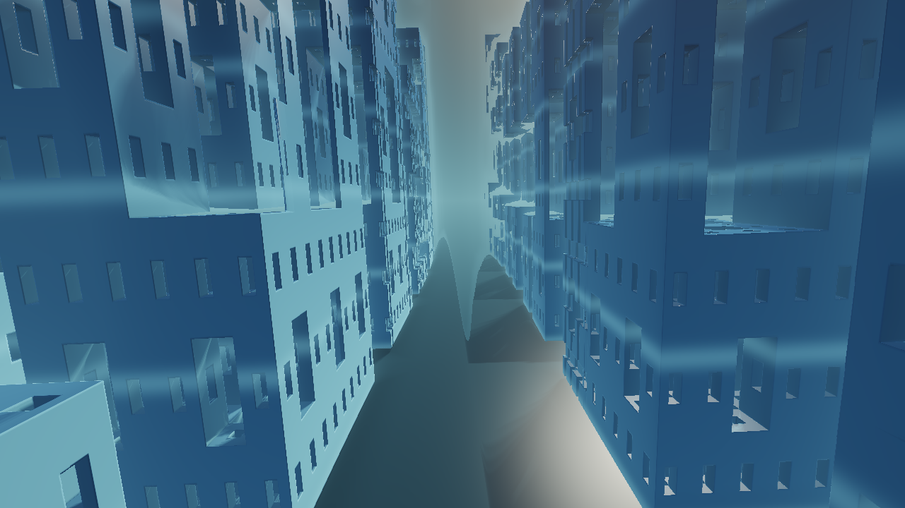
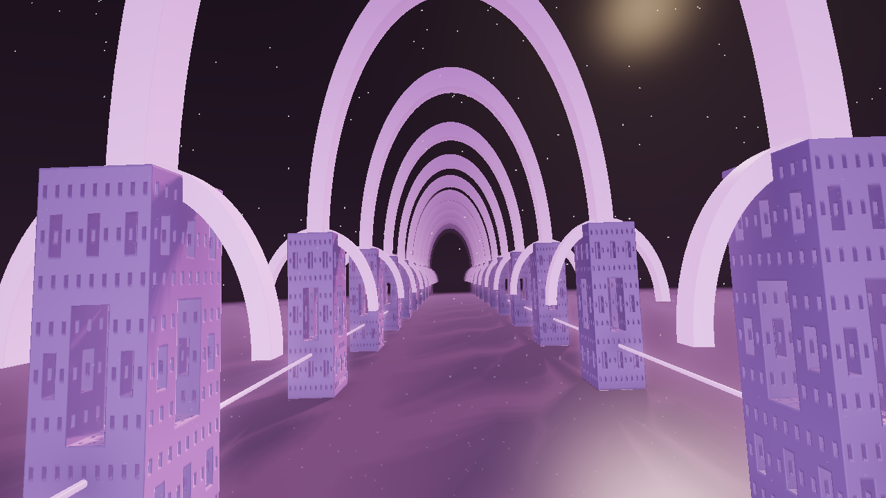
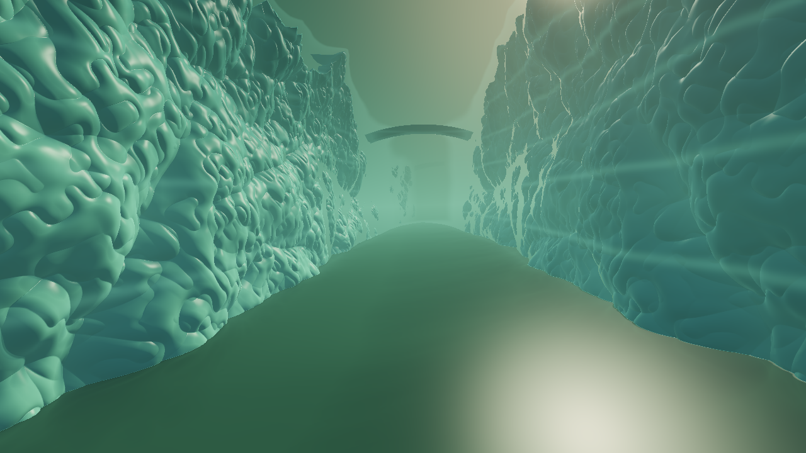
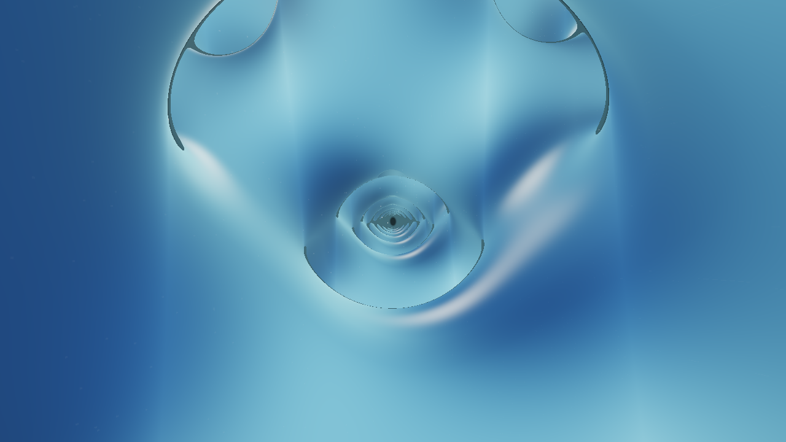
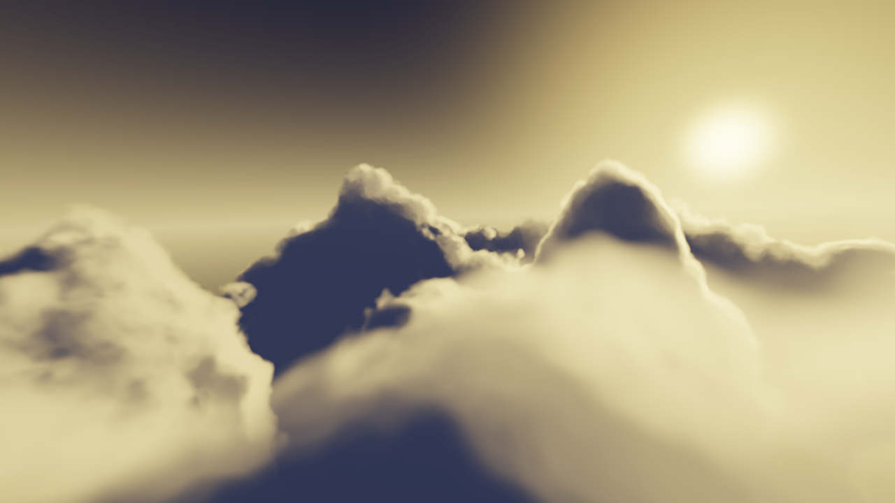
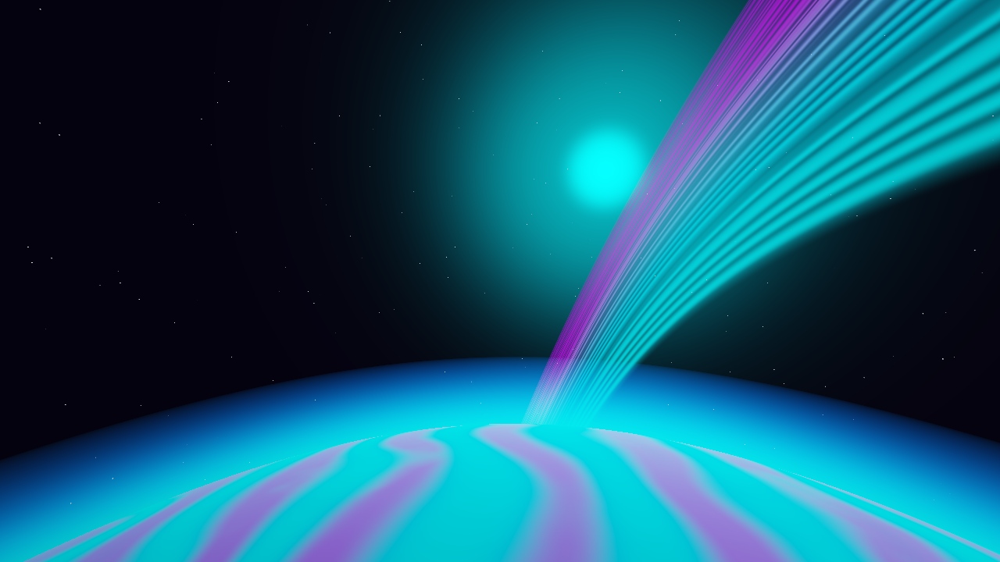

# Endless Scenes

The **Endless Scenes** category contains eight continuous environments. The separate **Endless Terrain** effect remains in its existing category and is also a useful starting point for flowing landscape motion.

These scenes create their worlds procedurally. “Endless” describes sustained travel through generated or repeating structures; it does not mean an infinitely large unique stored map or unlimited numeric precision.

## Choose a world

| Scene | Character | Start with |
| --- | --- | --- |
| **Menger Citadel** | Vast avenues through recursively carved towers | Glacial Megacity or Amethyst Spires |
| **Recursive Cathedral** | Repeating vaults, pillars, and long architectural corridors | Sanctuary of Light or Violet Reliquary |
| **Fractal Canyon** | Sculpted cliffs, terraces, passages, and bridges | Emerald River or Glacier Gates |
| **Infinite Lattice** | Continuous mathematical surfaces and open passages | Diamond Expanse or Neovius Dream |
| **Crystal Geode** | Flights among crystal formations inside an immense geode | Sapphire Needles or Opal Prism Voyage |
| **Golden Hour Clouds** | Flights through billowing cloud landscapes and sunlit atmosphere | Golden Cloud Kingdom or Stormlight Cathedral |
| **Planet Sunrise** | Orbital horizons, atmospheres, rings, and planetary worlds | Earth at First Light or Neon Ring Odyssey |
| **Robot Foundry** | Endless factories and a procession of articulated dancing robots | Neon Night Shift or Cosmic Conductors |

## A visual tour

| Menger Citadel | Recursive Cathedral |
| --- | --- |
|  |  |

| Fractal Canyon | Infinite Lattice |
| --- | --- |
|  |  |

| Crystal Geode | Golden Hour Clouds |
| --- | --- |
|  |  |

| Planet Sunrise | Mandelbulb Flight (Fractals category) |
| --- | --- |
|  |  |

## Build a flowing shot

Select a starter preset first. Adjust the scene's travel speed, height, field of view, and view distance before changing geometry. Then choose a palette and tune fog/glow so foreground detail and distant depth stay readable.

**Sway** and **Bank** affect the local flight path. Global Rotation, Zoom Pulse, and beat Zoom Punch can still move the entire picture on top of that path. For a calm forward journey, keep these global amounts low or zero and add beat reaction through light or color.

View Distance and Ray Detail can be expensive. Increasing them together at 4K makes much more work per frame. Use an interactive preview setting while composing, then a short full-detail test render before committing to a long output.

## Variation without losing the world

Every new endless scene exposes native palette choices plus the shared 71-palette library. Color Phase, Hue Shift, Saturation, Color Spread, and drift controls vary by effect. Presets combine structure, motion, and color; the full reference lists their actual overrides.

Use **Preserve scene** for FX/overlay shuffle. It favors treatments that leave the generated environment recognizable. Wild remains available for a more abstract result. Neither style changes the scene's own camera controls automatically merely because you selected it.

For a clean Robot Foundry shot, keep camera movement separate from dancing: Flight Speed can be zero while Music Response animates the robots. [Robot Foundry guide](Robot-Foundry.md).

Complete parameter tables and preset recipes: [Endless Scenes reference](Effects-Endless-Scenes.md). For older fractal flights and mathematical labs, see [Fractals and Math](Fractals-and-Math.md).
