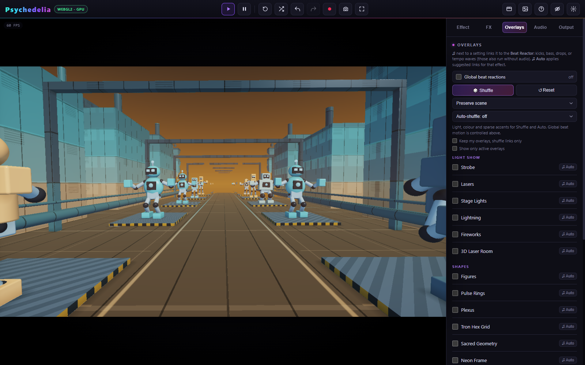

# FX and Overlays

**Post FX** transform the scene's image. **Overlays** add graphical content above it. Both expose beat links and separate shuffle controls.

## Post FX

The current library has **39 effects**, grouped into Distort, Feedback, Colour, Stylize, Glow & Blur, and Lens & Retro. Enable a pass, open its controls, and start with a small amount or mix where available. Several strong passes can compound.

FX are applied in the engine's defined order; the UI is not a freely reorderable node graph. Feedback/history effects depend on previous frames. Turning them on or switching scenes can therefore produce a settling period before the look stabilizes.

Use the music-note control beside a numeric setting to choose a Beat Reactor source and signed amount. The **Auto** reaction action applies that effect's suggested links. A numeric setting and a select-mode choice are different: mode switches are not continuously interpolated.

The [Post FX Reference](Post-FX-Reference.md) lists every pass, default, valid range, and mode choice.

## Overlays

The **22 overlays** are grouped into Light Show, Shapes, Atmosphere, and Audio & Text. They include light/strobe accents, lasers, stage effects, particles, graphical shapes, spectrum displays, text, and image layers.

Some overlays animate continuously. Others support **Fire On** or **Sync**, choosing Free Run, Kick, Snare, Hi-hat, Beat, Bar, or Drops. **Every Nth Hit**, where present, reduces trigger density. Without live audio, free-running timing or configured fallback animation can remain active.

Text and image overlays have their own placement and appearance controls. Select your image through the provided file input. Image assets can be retained by saved setups; external URLs may be subject to browser cross-origin restrictions in shader/media workflows.

Use the [Overlay Reference](Overlay-Reference.md) for all controls, including blend operators and coverage/intensity settings. A white-looking scene can be a valid full-coverage strobe or bright blend, not a shader error.

## Keep the underlying scene readable

1. Begin with one treatment and one sparse accent.
2. Lower intensity, opacity, mix, or coverage before adding more layers.
3. Watch the brightest parts of the scene while adjusting glow or additive layers.
4. Keep structural distortions off when showcasing an endless world or articulated robots.
5. Use **Preserve scene** shuffle when you want automatic variation within a restrained set.

Preserve scene constrains newly generated choices. It does not undo previously enabled manual distortions or global beat zoom. Use each panel's reset controls when starting a clean look.

See [Smart Shuffle](Smart-Shuffle.md) for bar scheduling, Keep existing, and Wild behavior.
