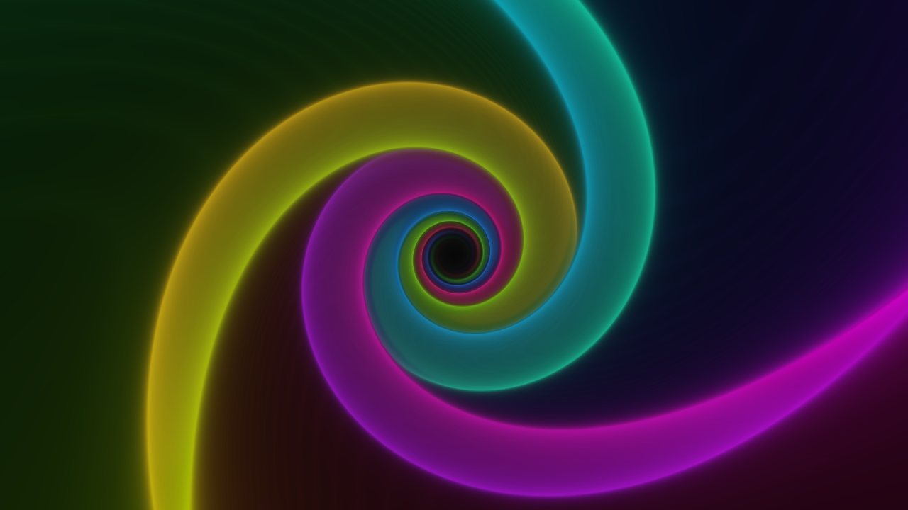
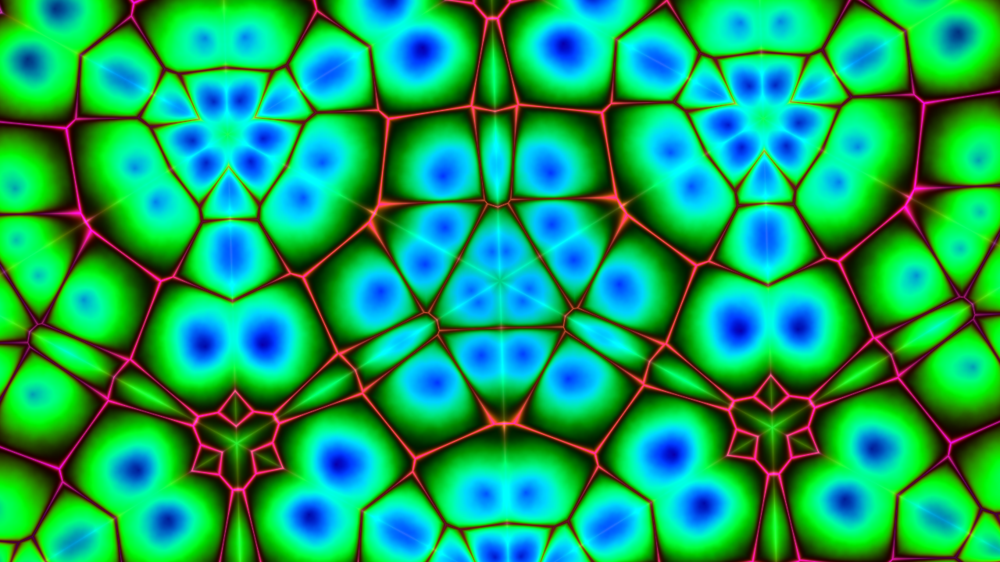
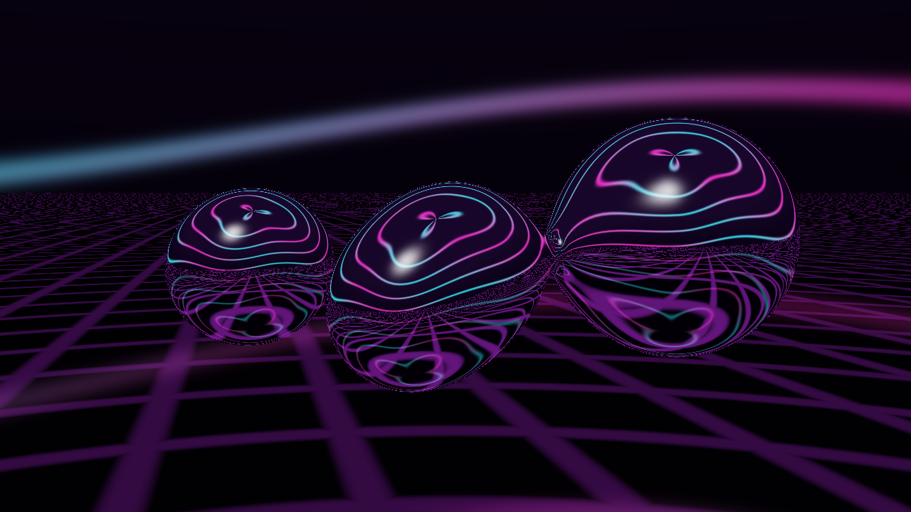
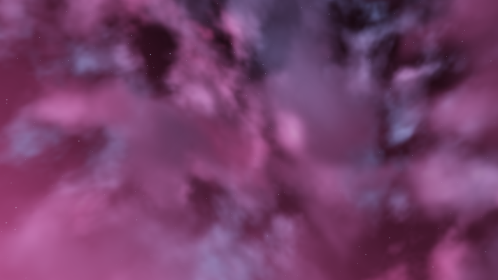

# Screenshot Gallery

These are actual renders and interface screenshots from Psychedelia Studio. No generated concept artwork is presented as app output. Scene captures use fixed time and seed, no Post FX/overlays, and disabled global reactions/parameter links unless a recipe says otherwise.

## Hero shot


**2560×1440 PNG.** Glow Lab, Wormhole mode, Synthwave palette, Glow 1.5, Twist 1.3, Detail 90, time 8 seconds. This is a scene-only render suitable for the README header. Full settings are in [capture-hero.json](capture-hero.json).

## Procedural variety

| Glow Lab | Kaleidoscope |
| --- | --- |
|  |  |

| Mandelbulb Flight | Liquid Chrome |
| --- | --- |
|  |  |



## Endless scene recipes

See the illustrated [Endless Scenes tour](Endless-Scenes.md) for all eight images. Each scene is 1280×720 at time 8 with seed 0 and seed vector `[0.31, 0.61, 0.83, 0.21]`.

| Image | Effect / preset |
| --- | --- |
| [Menger Citadel](images/menger-citadel.png) | Glacial Megacity |
| [Recursive Cathedral](images/recursive-cathedral.png) | Violet Reliquary |
| [Fractal Canyon](images/fractal-canyon.png) | Emerald River |
| [Infinite Lattice](images/infinite-lattice.png) | Diamond Expanse |
| [Crystal Geode](images/crystal-geode.png) | Opal Prism Voyage |
| [Golden Hour Clouds](images/golden-hour-clouds.png) | Stormlight Cathedral |
| [Planet Sunrise](images/planet-sunrise.png) | Neon Ring Odyssey |
| [Robot Foundry](images/robot-foundry.png) | Neon Night Shift |

The five additional scene samples above use their default base controls at the same time/seed. Starter-preset overrides are captured in [capture-scenes.json](capture-scenes.json). Rendering can still vary slightly by GPU and driver; progressive and simulation effects need additional state considerations.

## Interface screenshots

All interface captures use a **1600×1000** viewport. Click an image link for full size.

| Workflow | Image |
| --- | --- |
| Main workspace and effect controls | [Studio overview](images/studio-overview.png) |
| Dedicated MP4 render and output settings | [Render MP4](images/render-mp4.png) |
| FX browser and shuffle controls | [FX shuffle](images/fx-shuffle.png) |
| Overlay browser | [Overlays](images/overlays.png) |
| Studio Music | [Audio studio](images/audio-studio.png) |
| Mixer | [Music mixer](images/music-mixer.png) |
| Audio Source | [Source controls](images/audio-source.png) |
| Beat Reactor | [Global style and meters](images/beat-reactor.png) |
| Fine Tune | [Reaction and timing controls](images/beat-fine-tune.png) |
| Effect links | [Parameter links](images/parameter-links.png) |
| Named setup | [Saved setups](images/saved-setups.png) |
| Timeline sequencing | [Timeline](images/timeline.png) |
| Embedded shader editor | [Shadertoy Lab](images/shadertoy-lab.png) |

Interface screenshots illustrate control locations and are not performance benchmarks. The capture harness freezes scene time for framing; the visible preview FPS badge measures render cadence rather than animation speed. See [capture-panels.json](capture-panels.json).

## Reproduce

```sh
node tools/build-wiki-assets.mjs scenes
node tools/build-wiki-assets.mjs panels
node tools/build-wiki-assets.mjs hero
```

The tools use a clean temporary browser profile and write only documentation assets/metadata. They do not alter the user's working setup. [Development](Development.md) describes browser requirements.
