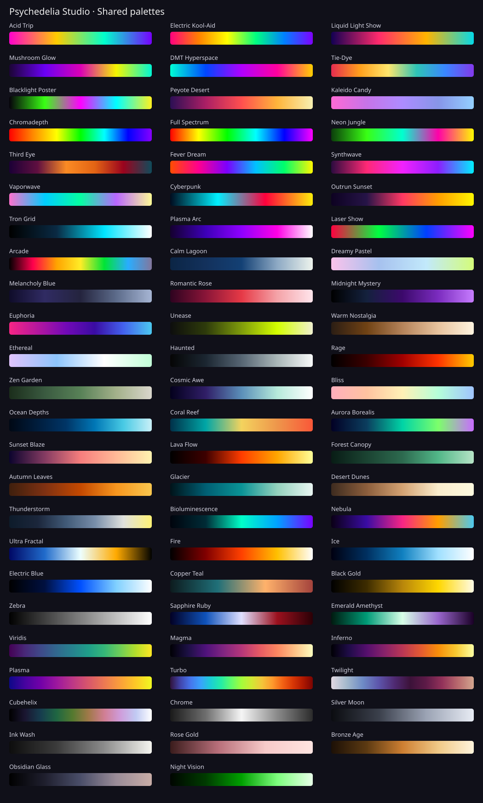

# Palette Reference

The **71 shared palettes** below are appended to effect controls that declare shared-palette support. Effect Originals remain first and vary by effect. Not every legacy effect exposes the shared library.

[Choosing and tuning color](Colors-and-Motion.md) · [Effect-native palette lists](Effect-Catalog.md)

## Psychedelic

- Acid Trip (cyclic)
- Electric Kool-Aid (cyclic)
- Liquid Light Show (cyclic)
- Mushroom Glow (cyclic)
- DMT Hyperspace (cyclic)
- Tie-Dye (cyclic)
- Blacklight Poster (cyclic)
- Peyote Desert
- Kaleido Candy (cyclic)
- Chromadepth
- Full Spectrum (cyclic)
- Neon Jungle (cyclic)
- Third Eye (cyclic)
- Fever Dream (cyclic)

## Neon & Retro

- Synthwave (cyclic)
- Vaporwave (cyclic)
- Cyberpunk (cyclic)
- Outrun Sunset
- Tron Grid
- Plasma Arc
- Laser Show (cyclic)
- Arcade (cyclic)

## Mood

- Calm Lagoon
- Dreamy Pastel (cyclic)
- Melancholy Blue
- Romantic Rose
- Midnight Mystery
- Euphoria (cyclic)
- Unease
- Warm Nostalgia
- Ethereal (cyclic)
- Haunted
- Rage
- Zen Garden
- Cosmic Awe
- Bliss (cyclic)

## Nature

- Ocean Depths
- Coral Reef (cyclic)
- Aurora Borealis (cyclic)
- Sunset Blaze
- Lava Flow
- Forest Canopy
- Autumn Leaves
- Glacier
- Desert Dunes
- Thunderstorm
- Bioluminescence (cyclic)
- Nebula (cyclic)

## Classic Fractal

- Ultra Fractal (cyclic)
- Fire
- Ice
- Electric Blue
- Copper Teal (cyclic)
- Black Gold
- Zebra (cyclic)
- Sapphire Ruby (cyclic)
- Emerald Amethyst (cyclic)

## Scientific

- Viridis
- Magma
- Inferno
- Plasma
- Turbo
- Twilight (cyclic)
- Cubehelix

## Metal & Mono

- Chrome (cyclic)
- Silver Moon
- Ink Wash
- Rose Gold
- Bronze Age
- Obsidian Glass
- Night Vision

Cyclic palettes wrap their end back to the beginning. Noncyclic palettes are useful for one-way ramps such as dark-to-light or cold-to-hot. Final color also depends on lighting, tone mapping, hue, saturation, and FX.
