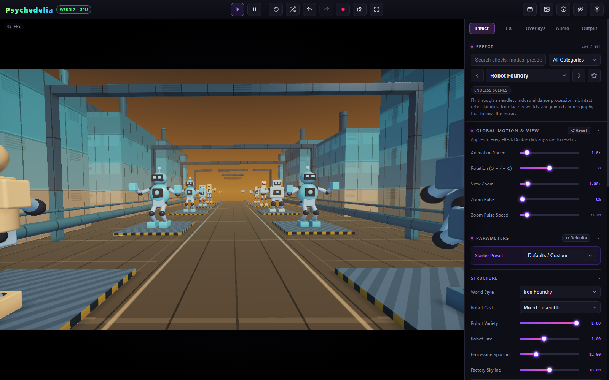

# Quick Start

## Run the app

[Open the live studio](https://aivrar.github.io/psychedelia-studio/) to try it immediately. To run a local copy, follow the steps below.

Download the repository and keep its folder structure intact. The main app is a static website: `index.html` loads the scripts in `src/` and the bundled Tone.js library in `lib/`. There is no installation or build step for the app itself.

For a consistent local address, open a terminal in the project folder and run:

```sh
python -m http.server 8000 --bind 127.0.0.1
```

Visit **http://localhost:8000** in Chrome or Edge. This command requires Python; any static web server is suitable. Keep using the same hostname and port to retain access to that origin's saved setups. Directly opening `index.html` is also supported by the core app, but browser media and storage behavior can differ on a file URL.

Use a desktop browser with WebGL and hardware acceleration. Chrome/Edge are the tested path for H.264/AAC exports; encoder support is checked at runtime. See [Troubleshooting](Performance-and-Troubleshooting.md) if a control reports unavailable support.

## Your first scene

1. Open **Effect** and search for **Crystal Geode**, **Robot Foundry**, or **Glow Lab**.
2. Choose a **Starter Preset**, when available, before editing individual controls.
3. Open the color group and choose a palette. Effect Originals appear before the shared library.
4. Adjust one or two structural controls, then the scene's speed. Use **Undo** to compare a change.
5. If the entire view rotates or pulses, check **Global Motion & View** and **Audio → Beat Reactor → Fine Tune**.



## Add music

Open **Audio**. Leave **Audio Source** on **Studio Music** and press the Music **Play** button. Choose a genre and adjust BPM. The first play action also gives the browser permission to start its audio context.

To use your own track, choose **Audio File**, press **Choose**, select a local file, and use the file's play button. Studio transport and file transport are separate. Stop any source you do not want audible during a live recording.

For restrained movement, try **Subtle** under **Global Style**. Open **Parameter Links** to inspect the suggested per-effect links. Those suggestions favor suitable light/color controls instead of large structural changes. [More about audio](Audio-and-Studio-Music.md).

## Render a 10-second MP4 at 60 FPS

1. Open **Output**.
2. Set **Resolution** to 720p or 1080p for a first test.
3. Set **Video FPS** to **60** and **Video Quality** to **High**.
4. Choose **Record app audio** under **Sound** to include the selected Studio/file soundtrack and its reactions. Choose **No sound** for a video-only render without audio-driven reactions.
5. In **Render MP4**, choose **Custom duration**, enter **10** seconds, and click **Render MP4**.
6. Wait through rendering and file saving. The MP4 downloads and is added to Gallery for this session.

The dedicated Render MP4 button always uses full-detail MP4 output. It does not require pressing Record or watching the clip for its playback duration. A heavy effect may take longer than 10 seconds to create a 10-second video.

With Studio Music, direct rendering generates a **new take from the current music settings**. It does not rewind and reproduce the exact song you were just hearing. To render a known soundtrack from its beginning, upload the file and choose **Match full audio track**. [All soundtrack and timing rules](Rendering-and-Recording.md).

## Save the look

Open **Audio → Saved Setups**, give the scene a name, and press **Save**. The latest working setup also autosaves locally. Saved setups do not resume sound automatically after reload. Keep important exported videos and original media files outside the browser.

Next: [Interface Guide](Interface-Guide.md), [Endless Scenes](Endless-Scenes.md), or [Beat Reactor](Beat-Reactor.md).
