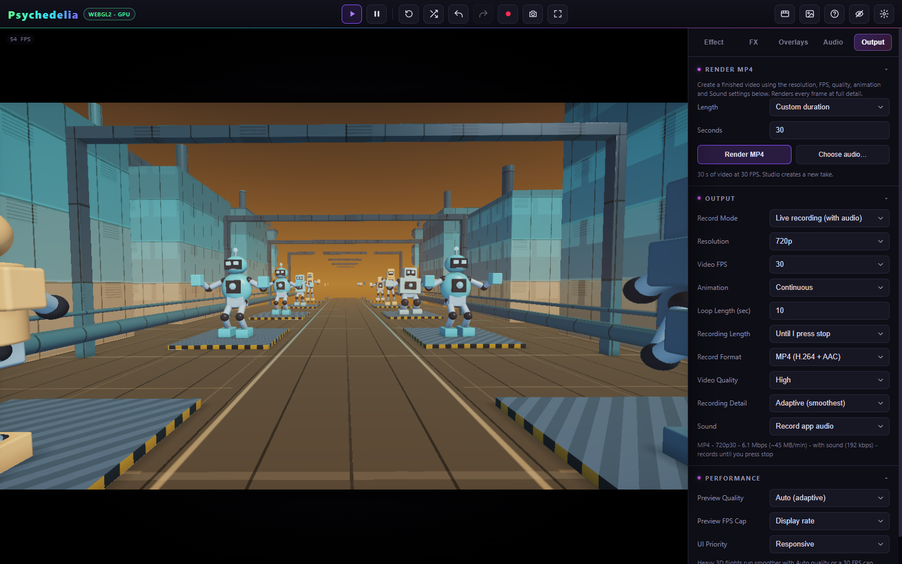

# Rendering and Recording

**Use Render MP4 for a finished video with every requested frame. Use Live recording for a performance you are changing as it happens.** Both workflows are available.

## Choose a workflow

| Workflow | How time advances | Best use | Main limits |
| --- | --- | --- | --- |
| **Render MP4** | One fixed output frame at a time; waits for rendering and encoders | Custom length, full uploaded song, remaining song; smooth 60 FPS output | MP4 only; Studio or file sound; timeline paused |
| **Record → Smooth MP4** | The same fixed-step approach, through the Record workflow | Existing recording-length controls and every-frame MP4 output | Set a recording length; offline audio restrictions apply |
| **Record → Live** | Real time, as the app runs | Interactive performances, captured playback audio, live changes | Frame rate depends on actual rendering performance |

Direct rendering still executes the scene, FX, overlays, and encoding. Light scenes can render faster than playback; heavy scenes can be slower. It improves frame completeness and can improve throughput. No measured reduction in total power consumption is claimed.

## Direct Render MP4: step by step

1. Set the scene, palette, FX, overlays, and audio reactions.
2. In **Output**, choose **Resolution**, **Video FPS**, **Video Quality**, **Animation**, and **Sound**.
3. In **Render MP4**, select a length mode and enter seconds if needed.
4. Click **Render MP4**. You can start with the preview paused.
5. Watch progress: percentage, completed frames, rendering speed, and estimated remaining time.
6. Wait for finalization and download. Creative controls remain locked through saving, not just frame rendering.

The dedicated button forces **MP4**, the **Smooth** path, and **full detail** for this job. It preserves your separate Record Mode, Recording Length, Record Format, and Recording Detail preferences afterward.

## Length and soundtrack behavior

| Length choice | Duration | File starting point | Loop behavior |
| --- | --- | --- | --- |
| **Custom duration** | Entered seconds, rounded to output frames | Current file playhead when Audio File is selected | Honors the file loop setting |
| **Match full audio track** | Entire uploaded track | Beginning of the file | Ignores file looping |
| **Remaining audio** | Current file position to its end | Current file playhead | Ignores file looping |

Full/remaining modes use the uploaded file even when the preview's selected source is Studio Music. **Choose audio** opens the file picker. Wait for the file to finish loading. A missing file, nonpositive remaining length, or unsupported duration is reported before rendering.

The preview's selected source, file position, and playing/paused state are preserved by the render workflow.

### Studio Music: where does it start?

With Custom duration and Studio Music selected, rendering builds a separate offline music engine from the current genre, BPM, key, scale, arrangement, energy, and mixer settings. It generates **a new take from its beginning**. It does not continue the live music playhead, and it cannot reproduce the exact already-generated live song merely by rewinding it.

Choose **Loop (no intro/break)** in the Music arrangement control when you want a more immediate repeating arrangement. Use an uploaded audio file when a specific, repeatable soundtrack is essential.

### Sound means more than the audio track

- **Record app audio** in the offline workflow includes the selected Studio/file soundtrack and drives audio reactions from that offline signal.
- **No sound** creates video-only output **without audio-driven reactions**. Tempo LFOs and independent scene animation/idle groove can still move.
- Full/remaining duration can still be measured from a file with No sound selected.
- **Capture Playback** cannot be replayed as an offline soundtrack. Use Live recording for that source.

## Getting a smooth 60 FPS file

Set **Video FPS → 60** explicitly; the default is 30. A two-second 60 FPS render schedules 120 output frames. The renderer advances the animation clock in fixed steps and waits for encoder capacity.

If the scene takes 35 milliseconds per frame, live playback cannot create 60 fresh frames per second. Offline rendering can create the same 120 frames over more than two seconds of wall time, then encode them on a 60 FPS time grid. Repeated images are still legitimate during silence, a frozen camera, or a static scene; FPS metadata alone does not prove that all frames contain different images.

The recent export audits decoded real MP4s and checked frame counts, time grids, and AAC duration. These establish the tested fixed-step behavior, not universal live performance at every resolution.

## Output controls

| Control | Choices / meaning |
| --- | --- |
| Resolution | 360p, 480p, 720p, 1080p, 1440p, or 4K; all provided video sizes are landscape 16:9. |
| Video FPS | 24, 30, or 60. |
| Video Quality | Draft, Standard, High, Very High, Maximum; increases encoder bitrate/file size, not shader complexity. |
| Animation | Continuous, or Loop with a configured loop length. |
| Loop Length | 1–300 seconds; resets the animation clock. A clock loop is not a guarantee of a seamless visual or audio loop. |
| Record Format | MP4 with H.264/AAC, or WebM with VP9/Opus where supported. Direct Render MP4 always uses MP4. |
| Recording Detail | Adaptive or Full detail for recording; direct rendering uses Full detail. |
| Recording Length | Until stopped, same as loop, or the provided timed lengths; used by the Record workflow. |
| Preview Quality / FPS Cap | Changes interactive preview load. The direct renderer advances independently of display refresh and preview FPS cap. |

Full detail refers to rendering resolution. It does not automatically maximize effect-specific iterations, ray steps, or detail settings. Those remain part of the look you configured.

## Stop, cancel, and save

**Cancel** discards the job. **Stop & save partial** finalizes frames already completed; it needs completed output to save. Sound is trimmed to the completed video span. During soundtrack preparation there may not yet be video frames available.

A completed or partial video downloads and appears in **Gallery**. Gallery is held in memory for this page session, so it is not a permanent media library. Keep the downloaded file. If automatic download behavior is blocked by the browser, use Gallery's download action.

## Limits to plan around

- Offline renders **with sound** support up to **600 seconds**. Video-only custom renders support up to **3,600 seconds**. These are input limits, not memory or speed guarantees.
- Duration rounds to the nearest frame with at least one output frame.
- The timeline must be paused before a smooth render. Direct rendering is not a frame-by-frame timeline exporter.
- External video/webcam/capture channels do not become deterministic offline video inputs. Prefer live capture for effects dependent on them.
- Progressive worker effects and history-dependent simulations can depend on convergence or prior frames. Fixed timestamps alone do not guarantee identical images across separate runs.
- Large exports use substantial browser memory and can take time to finalize. Test a short clip before a long 4K job.
- MP4 support depends on the browser's available H.264/AAC encoders. Check the displayed support/error message rather than assuming playback support implies encoding support.

For diagnosis, see [Performance and Troubleshooting](Performance-and-Troubleshooting.md). For soundtrack selection, see [Audio and Studio Music](Audio-and-Studio-Music.md).
