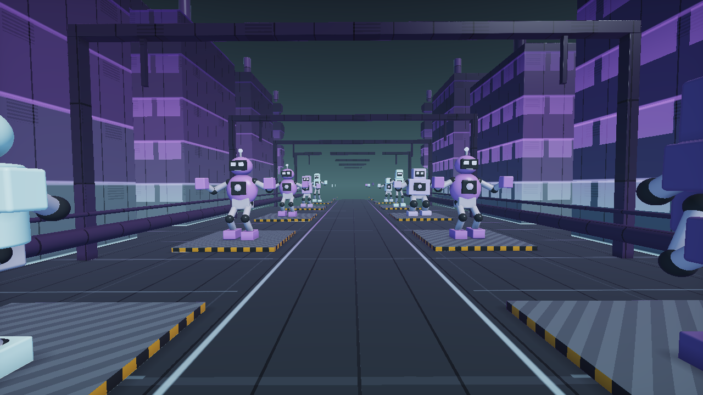

# Robot Foundry

Fly along an endless industrial avenue past dancing robots, factory towers, pipes, bridges, cranes, and smokestacks. Robot identities are seeded by world location so approaching machines keep their family and proportions as the camera travels.

Select **Effect → Endless Scenes → Robot Foundry**. **Neon Night Shift** is a good first preset; **Cosmic Conductors** shows a different world and four-arm cast.

## Worlds, cast, and dances

| Choice | Available styles |
| --- | --- |
| World Style | Iron Foundry, Neon Assembly, Retro Machine City, Cosmic Refinery |
| Robot Cast | Mixed Ensemble, Boxbots, Cyclops, Striders, Heavy Loaders, Astrobots, Four-Arm Conductors |
| Dance Style | Factory Groove, Robot Pop, Disco Signal, Circuit Wave |
| Native palettes | Copper Circuit, Toxic Mint, Ultraviolet Steel, Ice Chrome, Magenta Reactor, Solar Rust, Prismatic Oil |
| Starter presets | Copper Parade, Neon Night Shift, Retro Disco District, Cosmic Conductors, Mint Machine Carnival, Chrome Giants |

The native palettes are followed by 71 shared palettes. Palette Phase, Hue Shift, Saturation, Color Spread, and Color Drift provide more variation within a chosen palette.

## Controls that make the largest difference

| Control | Result |
| --- | --- |
| Robot Variety | Broadens the mixed cast and varies size slightly. An individual cast keeps its family while varying size. |
| Robot Size | Scales the complete articulated machine. |
| Procession Spacing | Changes the distance between robot stages. |
| Factory Skyline | Raises or lowers the industrial surroundings. |
| Dance Amount | Overall pose movement; zero freezes the robots' dance. |
| Music Response | Strength of the music-driven contribution. |
| Idle Groove | Movement during silence; zero removes idle dancing. |
| Ensemble Sync | High values align choreography; low values stagger the ensemble. |
| Flight Speed | Moves the camera; zero holds the viewpoint. |
| Beat Light | Music-driven eye, chest, lane, and factory lighting. |
| Ray Detail / View Distance | Detail and distant scenery versus render cost. |

The dance follows Beat Reactor's musical clock. Studio provides sequencer tempo; uploaded music uses detected or locked tempo. During silence, idle choreography uses the Studio tempo.

## Make the robots dance, keep the camera still

1. Set **Flight Speed** to zero.
2. Set global Rotation and Zoom Pulse to zero.
3. In Beat Reactor, set Zoom Punch, Rotation Kick, and Shake to zero, or turn global reactions off.
4. Leave Dance Amount and Music Response above zero.
5. Set Idle Groove to zero if you want the robots to stop when the music is silent.
6. Play Studio Music or an uploaded file and watch the hit/band meters.

This isolates built-in choreography from whole-image movement. If the start of a song is silent, identical frames before the first audible beat are expected with idle dancing disabled.

## Why the bodies stay connected

The shader articulates rigid torsos, connected fixed-length arms, and two-bone legs. Music intensity and joint angles are bounded. Structural and dance controls are excluded from generic parameter links, so suggested links do not continuously rescale body parts.

Post FX can still intentionally distort the finished image. Use Preserve scene or disable a distortion pass if a robot appears twisted after a shuffle.

For exact ranges and preset values, see [Robot Foundry reference](Effects-Endless-Scenes.md#robot-foundry). For export behavior, see [Rendering and Recording](Rendering-and-Recording.md).
