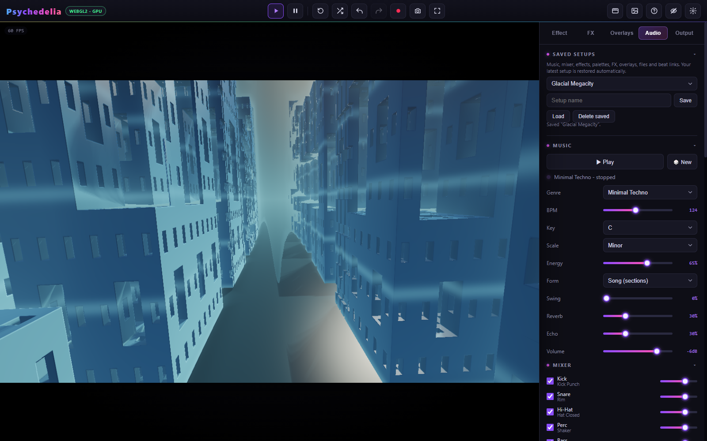

# Setups and Undo

## Named setups

Open **Audio → Saved Setups**. Enter a name and press **Save**. Choose an existing entry and press **Load** to restore it. Saving with an existing name updates that saved entry. **Delete saved** removes the named entry while leaving the current scene available.

There can be up to **50 named setups**, with names up to **80 characters**. Storage is local to this browser profile and origin. The app also autosaves the latest working setup, so named saves are best used as intentional milestones.

## What a setup contains

| Included | Separate or excluded |
| --- | --- |
| Active effect, base parameter values, palette and seed | Playback position and elapsed transport time |
| Global motion/view settings | A recording or rendered video file |
| Studio Music configuration and mixer | Exact replay of an already generated live musical take |
| Selected source, file gain/loop, attached audio file | Permission to resume screen/audio capture |
| Beat Reactor settings, timing, and per-effect links | Timeline projects, which have their own Save/Load JSON |
| FX/overlay states, settings, modulation, image assets | Custom Shadertoy projects, which have their own library and JSON export |
| Shuffle styles, keep flags, and intervals | Undo history as a portable project history |

Assets are stored in IndexedDB along with setup records. A browser storage failure is reported; keep original audio/images separately. Restoring a setup does not automatically play music or begin capture. An early user edit during startup takes precedence over a delayed autosave restore.

A localhost port is part of the storage origin. `localhost:8000`, `localhost:9000`, `127.0.0.1:8000`, and a hosted site have separate browser storage. Moving the source folder does not migrate a server-origin database to another address.

## Undo and redo

Use the toolbar arrows, **Ctrl/Cmd+Z**, **Ctrl/Cmd+Y**, or **Ctrl/Cmd+Shift+Z**. The app keeps up to **80 entries** for supported user-driven creative edits.

Slider drags are grouped into useful actions. Compound edits such as presets, randomization, supported resets, and effect switches are restored together. History operates on base settings rather than recording every animation frame or every temporary beat-modulated value.

Automatic shuffle, advancing audio/visual clocks, and ongoing modulation do not create a stream of undo entries. Undo is not a way to rewind music or replay a previous live animation frame. Ordinary undo also avoids rewinding an accumulated rotation angle; an explicit Motion Reset has angle-restoration behavior because that was the edit itself.

Loading a setup starts a fresh history context. Export/finalization and active timeline playback can lock editing/history. When typing in a text field, the browser's normal text undo takes priority.

## Recovery habits

Save a named setup before a large style change, retain original media outside the browser, and download important videos. Timeline and custom shader work need their own explicit exports. Clearing site data or using a different browser profile can remove access to local work.

See [Storage and Privacy](Storage-and-Privacy.md) for where data lives.
