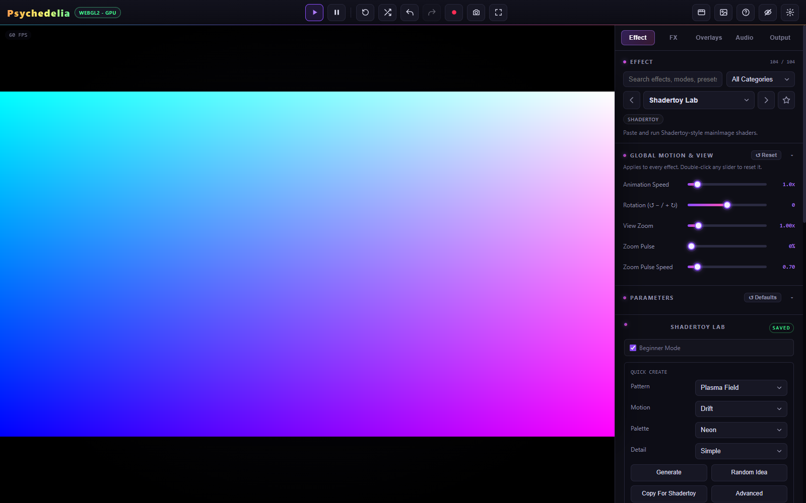

# Shadertoy Lab

Shadertoy Lab is an embedded editor and host for Shadertoy-style `mainImage` shaders, with Common, Image, and Buffer A–D passes. It includes guided templates, a local project library, JSON import/export, and optional public API import.



## Start without writing GLSL

1. Select **Shadertoy Lab** from Effect.
2. Leave **Beginner Mode** enabled.
3. In **Quick Create**, choose Pattern, Motion, Palette, and Detail.
4. Press **Generate** to build and compile the project, or **Random Idea** for another template combination.
5. Open the Image pass to inspect or edit the generated source.

Patterns include plasma, rings, tunnels, kaleidoscopes, raymarched forms, feedback trails, mouse painting, texture warps, and several audio-reactive templates. These are supported templates, not arbitrary generated shader code.

Built-in starter examples and Quick Create do not require an API key or a Shadertoy account.

## Shader entry point

```glsl
void mainImage(out vec4 fragColor, in vec2 fragCoord) {
    vec2 uv = fragCoord / iResolution.xy;
    fragColor = vec4(uv, 0.5 + 0.5 * sin(iTime), 1.0);
}
```

The host supplies `iResolution`, `iTime`, `iTimeDelta`, `iFrameRate`, `iFrame`, `iMouse`, `iDate`, `iSampleRate`, `iChannelTime[4]`, `iChannelResolution[4]`, `iChannelDate[4]`, and samplers `iChannel0` through `iChannel3`.

**Common** is prepended to enabled passes. Buffers render in A, B, C, D order, then Image renders the visible result. A buffer sampling itself reads the previous frame through ping-pong textures. Keep these dependencies in mind when adapting a multipass project.

## Channels

Available channel types include none, buffer, self, procedural, image, keyboard, audio, video, webcam, and microphone. Configure the channels for the pass that uses them; each pass has its own assignments. Webcam/microphone channels request their own browser permissions.

Audio channels use the app's selected Audio Source. The analyser texture is **512×2 RGBA unsigned byte**:

| Row | Sample near | Content |
| --- | --- | --- |
| 0 | `v = 0.25` | Waveform / time-domain samples |
| 1 | `v = 0.75` | FFT / spectrum samples |

The app's audio templates use this layout. Check row assumptions when importing code from elsewhere. Feedback audio templates commonly use Buffer A channel 0 for audio and channel 1 for prior-frame state.

## Advanced mode and project storage

Advanced controls expose the local library, JSON import/export, render-target formats, diagnostics, paste options, Safe Mode, and API import. Use the shader library or JSON export to preserve custom projects; normal Saved Setups do not bundle them.

The optional Shadertoy API import accepts a public shader ID with an app key. It can only fetch projects the API makes available. Safe Mode prevents automatic compilation after API import so you can inspect the loaded code and channel assignments before running it.

The API key is kept in browser local storage. Do not put a personal key into source files, screenshots, or exported repository examples.

## Copying to Shadertoy

**Copy For Shadertoy** creates a sectioned text bundle. Create/open a shader on the external site and paste each section into the corresponding Common, Image, and Buffer tabs. Configure the noted channel inputs manually.

The app does not upload or publish to a Shadertoy account. Titles, tags, visibility, licensing, and website publication remain separate actions. Keep source attribution and the license of imported shaders.

## Compatibility and errors

- Cubemap channels, VR/cubemap render passes, and `mainSound` GPU audio are not implemented.
- Unsupported API passes are skipped and noted in the imported description.
- Browser cross-origin rules can block external media. Failed channels bind black and report an error; a black channel does not necessarily mean the shader formula is invalid.
- Float/half-float targets depend on WebGL support and framebuffer completeness, with fallbacks where available.
- Some site-specific shaders require manual adaptation.
- Live video and webcam content should not be treated as deterministic offline-render inputs.

Use **Compile All** or **Run**, then inspect the pass error and channel diagnostics. Start from a working built-in example to separate a host/support issue from imported code.
