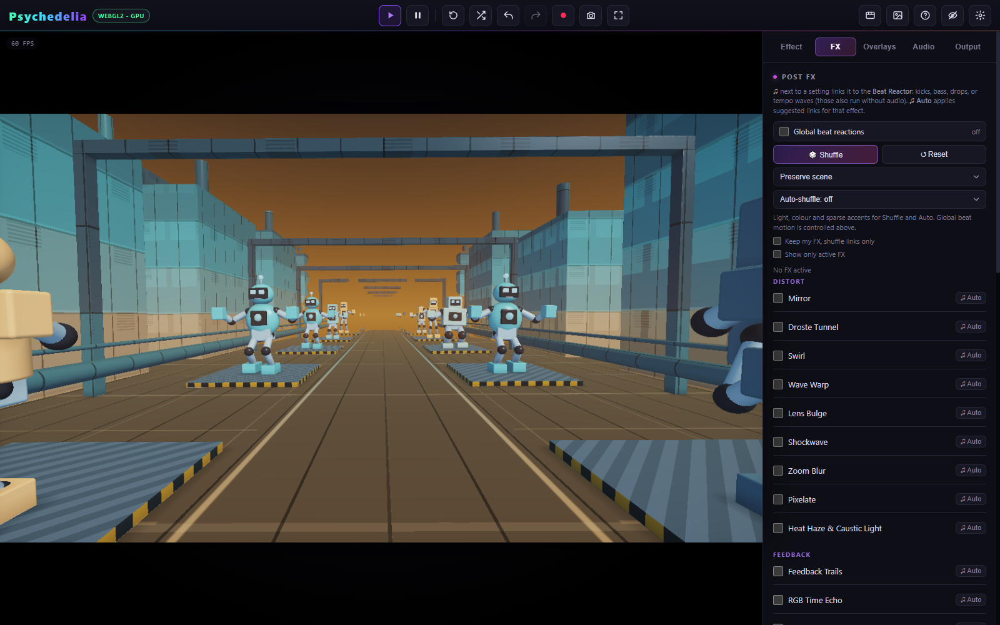

# Smart Shuffle

Shuffle can vary **FX**, **Overlays**, and **Beat Reactor** independently. Each scope has a style and an auto-shuffle schedule. Choose how much freedom a shuffle has before scheduling it.

## Preserve scene or Wild

| Style | Intended result |
| --- | --- |
| **Preserve scene** | Light/color changes and sparse accents, using restrained pools and ranges. Keeps the base scene recognizable. |
| **Wild — full effects** | Includes twists, mirrors, movement, and broader visual changes. Generated settings still have bounds to reduce washout and excessive coverage. |

Preserve scene is the default. These profiles govern **Shuffle** and **Auto**; they do not remove manual controls or reduce the full range available when editing a setting yourself.

A style change does not immediately clean up effects already enabled. If an earlier Wild shuffle left a strong mirror or distortion active, reset that panel or switch it off before judging a new restrained setup. Global Zoom Punch, global rotation, and scene-native animation are also separate.

## Keep existing FX / overlays

When **Keep existing** is enabled, shuffle works on beat links for the currently enabled items instead of choosing a fresh combination and replacing their base settings. If no items are enabled, it leaves that scope empty.

This is useful after you manually build a look: keep a chosen grade and overlay, then vary their reaction routes without replacing their identities. The style still governs how restrained those new routes are.

**Show only active** is a browsing filter. It does not enable or disable processing.

## Every 4, 8, or 16 bars

The scheduler treats **one bar as four beats**. The timing follows the app's musical/render clock rather than a wall-clock timer. At 120 BPM:

| Interval | Beats | Nominal time |
| --- | --- | --- |
| 4 bars | 16 | 8 seconds |
| 8 bars | 32 | 16 seconds |
| 16 bars | 64 | 32 seconds |

Studio Music provides its sequencer tempo. External music follows the reactor's detected or locked tempo. With no live music, the tempo waves use Studio BPM. Pausing visual time pauses frame-driven progression; slow offline rendering still reaches shuffle boundaries in output time.

**Each section** uses Studio arrangement changes. Outside Studio section events, it falls back to a 16-bar schedule. It does not identify the verse or chorus structure of every uploaded track.

The scheduler avoids firing repeatedly for a single crossed boundary. Tempo changes affect future progression; a bar schedule is not a fixed number of seconds independent of BPM.

## Suggested starting setups

- **Endless fly-through:** FX Preserve scene every 16 bars; sparse overlays every 16 bars or Off; global Rotation Kick and Shake at zero.
- **Music visualizer:** Preserve scene every 8 bars with a few beat-linked lighting accents.
- **Experimental performance:** Wild with manual Shuffle first; enable a 4-bar schedule only after reviewing the range of changes.
- **Carefully composed look:** enable Keep existing for both FX and overlays, and use slow modulation.

These are recipes, not named presets. Save the result as a setup to retain the style, interval, enabled items, and link configuration.

Manual shuffle is a creative edit. Automatic scheduled changes do not flood undo history with an entry every few bars. See [Setups and Undo](Setups-and-Undo.md).
