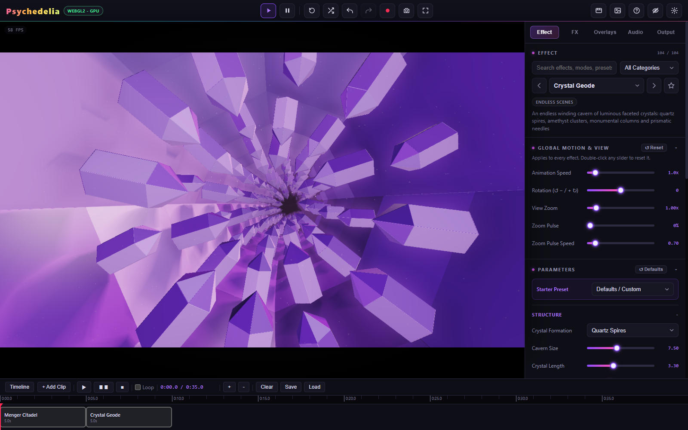

# Timeline

Timeline sequences effect clips for live playback. Open it with **T** or the top toolbar button. It is separate from the direct Render MP4 workflow.

## Make a sequence

1. Configure an effect and any overlay settings you want captured.
2. Click **+ Add Clip**. The new clip is appended after the last clip and starts with a five-second duration.
3. Switch to another effect, set its look, and add another clip.
4. Move clips along the track and resize their edges, or use the clip editor's numeric Start and Duration fields.
5. Choose **Cut** or **Flash Cut** as the transition.
6. Press the timeline Play control. Pause holds the timeline; Stop rewinds it. Loop repeats the sequence.

Click the track to seek. The +/− controls change the track's display scale, not the rendered video resolution.

## Clip editing

The editor provides Effect, Start, Duration, Transition, Duplicate, Delete, and **Snapshot Current**. A captured clip holds the selected effect's base parameters, effect seed, and overlay state. Snapshot Current updates the selected clip from the current controls.

A clip is not a complete named setup. It does not represent a separate saved Studio song, full audio-source state, or independently mixed soundtrack. Design audio and global processing with that distinction in mind.

The supported transitions are **Cut** and **Flash Cut**. There is no crossfade compositor or multitrack nonlinear editing system hidden behind this panel.

## Save and load

**Save** downloads `psychedelia_timeline.json`. **Load** opens a timeline JSON file. Keep that file if the sequence matters: normal Saved Setups do not contain timeline projects. Referenced custom assets and custom shader work need their own preservation; a JSON timeline is not a bundled media archive.

## Record a sequence

Use **Live** recording to capture timeline playback. Its smoothness depends on the machine's actual render performance. The direct and Smooth MP4 paths require a paused timeline and render the configured scene; they are not an offline timeline exporter.

If you need a precisely rendered multi-scene production, render each scene separately and assemble the clips in a video editor. See [Rendering and Recording](Rendering-and-Recording.md).
